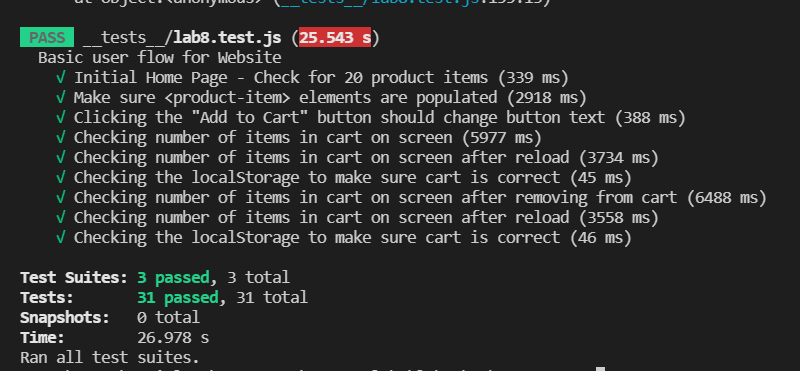

# Lab 8 - Starter

Group: Daniel Lam

1) Where would you fit your automated tests in your Recipe project development pipeline?  
`Within a Github action that runs whenever code is pushed` 
because we would want to check if the test cases still passed after making any changes to the repository.

2) Would you use an end to end test to check if a function is returning the correct output? (yes/no)  
`No` because end-to-end testing is much better for testing how the user will interact with the webpage and making sure that all things are working from a user's perspective. Unit testing would be much better to isolate the function and test it.

3) Would you use a unit test to test the “message” feature of a messaging application? Why or why not? For this question, assume the “message” feature allows a user to write and send a message to another user.  
`No` because the write and send are two different functions. I would use a unit test to test each part of "messaging" individually but end-to-end testing for the whole messaging test.

4) Would you use a unit test to test the “max message length” feature of a messaging application? Why or why not? For this question, assume the “max message length” feature prevents the user from typing more than 80 characters.  
`Yes` I would use a unit test to check the max message length because it doesn't require many different components to work together. The max message length is encapsulated enough to encourage the use of a unit test.  

Screenshot of `npm test`

